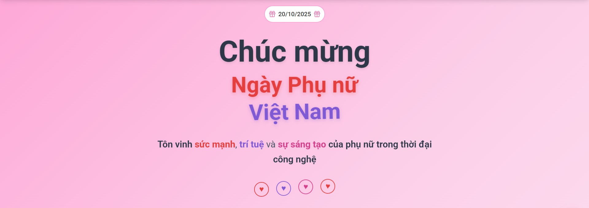

# 🎉 Landing Page Chúc Mừng Ngày Phụ Nữ Việt Nam 20/10



Landing page đặc biệt chúc mừng Ngày Phụ nữ Việt Nam 20/10/2025, được thiết kế với giao diện hiện đại, đẹp mắt và đầy cảm xúc. Ứng dụng tôn vinh sức mạnh, trí tuệ và sự sáng tạo của phụ nữ trong thời đại công nghệ.

## 📖 Mục lục

- [Giới thiệu](#-giới-thiệu)
- [Live Demo](#-live-demo)
- [Tính năng](#-tính-năng)
- [Công nghệ sử dụng](#-công-nghệ-sử-dụng)
- [Yêu cầu hệ thống](#-yêu-cầu-hệ-thống)
- [Cài đặt](#-cài-đặt)
- [Cấu hình môi trường](#-cấu-hình-môi-trường)
- [Chạy dự án](#-chạy-dự-án)
- [Build & Deploy](#-build--deploy)
- [Cấu trúc thư mục](#-cấu-trúc-thư-mục)
- [Screenshots](#-screenshots)
- [Đóng góp](#-đóng-góp)
- [License](#-license)

## 🔰 Giới thiệu

**Mô tả:**

Đây là một landing page đặc biệt được tạo ra để chúc mừng Ngày Phụ nữ Việt Nam 20/10/2025. Ứng dụng được thiết kế với giao diện đẹp mắt, hiện đại, sử dụng gradient màu hồng và các hiệu ứng animation mượt mà để tạo trải nghiệm người dùng tuyệt vời.

**Đối tượng người dùng:**

- Tất cả mọi người muốn gửi lời chúc mừng đến phụ nữ Việt Nam
- Các tổ chức, doanh nghiệp muốn tạo landing page chúc mừng
- Developers muốn tham khảo code cho các dự án tương tự

**Giá trị chính:**

- ✨ Giao diện đẹp mắt, hiện đại với animation mượt mà
- 💝 Thông điệp ý nghĩa, tôn vinh phụ nữ Việt Nam
- 📱 Responsive design, hoạt động tốt trên mọi thiết bị
- 🎨 Trải nghiệm người dùng tuyệt vời với các hiệu ứng tương tác

## 🌐 Live Demo

🔗 **Deploy tại:** [https://project-landingpage-2010.vercel.app](https://project-landingpage-2010.vercel.app)

## ✨ Tính năng

✔️ **Responsive trên mọi thiết bị** - Tối ưu cho desktop, tablet và mobile

✔️ **Splash Screen** - Màn hình chào mừng với animation đẹp mắt

✔️ **Scroll Progress Indicator** - Thanh tiến trình cuộn trang

✔️ **Love Letter Popup** - Thư chúc mừng tự động hiển thị

✔️ **Inspirational Slides** - Carousel hiển thị các câu nói truyền cảm hứng từ những người phụ nữ nổi tiếng

✔️ **Image Gallery** - Bộ sưu tập hình ảnh đẹp mắt

✔️ **Smooth Animations** - Các hiệu ứng animation mượt mà, chuyên nghiệp

✔️ **Giao diện UI hiện đại** - Thiết kế với Tailwind CSS, gradient và shadow effects

## 🛠 Công nghệ sử dụng

- **Framework:** React 19.1.1
- **Language:** TypeScript 5.9.3
- **UI Library:** Tailwind CSS 4.1.14
- **Build Tool:** Vite 7.1.7
- **Slider/Carousel:** Swiper 12.0.2
- **Code Quality:** ESLint, TypeScript ESLint
- **Deployment:** Vercel

## 🧾 Yêu cầu hệ thống

- **Node.js** >= 16.x
- **npm** / **yarn** / **pnpm**
- **Trình duyệt hiện đại** (Chrome, Edge, Firefox, Safari)

## 📦 Cài đặt

### 1. Clone dự án

```bash
git clone https://github.com/username/project-landingpage-2010.git
cd project-landingpage-2010
```

### 2. Cài đặt dependencies

```bash
npm install
# hoặc
yarn install
# hoặc
pnpm install
```

## ⚙️ Cấu hình môi trường

Dự án này không yêu cầu cấu hình môi trường đặc biệt. Tuy nhiên, nếu bạn muốn thêm các biến môi trường, tạo file `.env`:

```env
VITE_APP_TITLE=Landing Page 20/10
VITE_APP_DESCRIPTION=Chúc mừng Ngày Phụ nữ Việt Nam
```

## 🚀 Chạy dự án

### Development

```bash
npm run dev
```

Ứng dụng sẽ chạy tại: `http://localhost:5173`

### Build production

```bash
npm run build
```

### Preview production build

```bash
npm run preview
```

### Lint code

```bash
npm run lint
```

## 🚢 Build & Deploy

### Build output

Build output nằm tại thư mục `dist/`

### Triển khai

Dự án đã được cấu hình sẵn cho **Vercel**. Bạn có thể deploy bằng cách:

1. **Vercel CLI:**
```bash
npm i -g vercel
vercel
```

2. **GitHub Integration:**
   - Kết nối repository với Vercel
   - Vercel sẽ tự động deploy khi có commit mới

3. **Các nền tảng khác:**
   - **Netlify:** Kéo thả thư mục `dist/` vào Netlify
   - **GitHub Pages:** Sử dụng GitHub Actions
   - **AWS S3 + CloudFront:** Upload `dist/` lên S3
   - **Cloudflare Pages:** Kết nối repository

## 📁 Cấu trúc thư mục

```
src/
 ├── assets/              # Ảnh, icons
 │   ├── icon.png
 │   └── images/          # Bộ sưu tập hình ảnh
 │       ├── 1.jpg
 │       ├── 2.jpg
 │       └── ...
 ├── components/           # Component dùng chung
 │   ├── Footer.tsx
 │   ├── ImageBanner.tsx
 │   ├── ImageGallery.tsx
 │   ├── InspirationalSlide.tsx
 │   ├── LoadingProgress.tsx
 │   ├── LoveLetter.tsx
 │   └── SplashScreen.tsx
 ├── layout/              # Layout
 │   └── Header.tsx
 ├── types/               # TypeScript types
 │   └── swiper.d.ts
 ├── App.tsx              # Component chính
 ├── App.css              # Styles cho App
 ├── index.css            # Global styles
 └── main.tsx             # Entry point

public/
 ├── banner.jpeg          # Banner chính
 ├── banner.jpg
 ├── icon.png
 └── vite.svg

vercel.json               # Cấu hình Vercel
vite.config.ts            # Cấu hình Vite
tsconfig.json             # Cấu hình TypeScript
```

## 🖼️ Screenshots


*Banner chính của landing page - Chúc mừng Ngày Phụ nữ Việt Nam 20/10/2025*

### Các tính năng chính:

- **Splash Screen:** Màn hình chào mừng với animation
- **Header:** Navigation bar với logo và menu
- **Hero Section:** Tiêu đề chính với animation đẹp mắt
- **Inspirational Slides:** Carousel hiển thị các câu nói truyền cảm hứng
- **Image Gallery:** Bộ sưu tập hình ảnh
- **Footer:** Thông tin liên hệ và credits

## 🤝 Đóng góp

Chúng tôi rất hoan nghênh mọi đóng góp! Để đóng góp:

1. **Fork** repository
2. Tạo **branch** mới (`git checkout -b feature/AmazingFeature`)
3. **Commit** các thay đổi (`git commit -m 'Add some AmazingFeature'`)
4. **Push** lên branch (`git push origin feature/AmazingFeature`)
5. Mở **Pull Request**

### Coding Style

- Tuân thủ **ESLint** rules đã cấu hình
- Sử dụng **TypeScript** cho type safety
- Format code với **Prettier** (nếu có)
- Viết code ngắn gọn, dễ đọc
- Comment code khi cần thiết

## 📄 License

Dự án này được phân phối dưới giấy phép **MIT**. Xem file `LICENSE` để biết thêm chi tiết.

---

**Made with ❤️ for Vietnamese Women's Day 20/10/2025**

*Tôn vinh sức mạnh, trí tuệ và sự sáng tạo của phụ nữ trong thời đại công nghệ*
